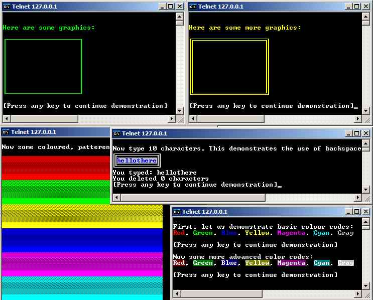



## ANSI Telnet Classes

### Description

Have you ever wondered how to do colour codes? Boxes? ASCII Graphics etc in telnet? Ever wanted to write your own MUD or telnet game? Then this code is for you. It provides 4 classes: CDrawing, CCursor, CErase and CColor to provide most of the methods you could want to use for, (example), a MUD game. Included is a small demonstration. I know the code is pretty horrible, and uncommented but that's because it was written in a hurry in amongst tonnes of other projects :) Leave some feedback if you like or dislike anything about it, or want to add some suggestions or anything.
 
### More Info
 

             |
---                |---
**Submitted On**   |2004-02-02 19:13:52
**By**             |[IRBMe](https://github.com/Planet-Source-Code/PSCIndex/blob/master/ByAuthor/irbme.md)
**Level**          |Beginner
**User Rating**    |3.4 (17 globes from 5 users)
**Compatibility**  |VB 6\.0
**Category**       |[Graphics](https://github.com/Planet-Source-Code/PSCIndex/blob/master/ByCategory/graphics__1-46.md)
**World**          |[Visual Basic](https://github.com/Planet-Source-Code/PSCIndex/blob/master/ByWorld/visual-basic.md)
**Archive File**   |[ANSI\_Telne170541272004\.zip](https://github.com/Planet-Source-Code/irbme-ansi-telnet-classes__1-51568/archive/master.zip)

